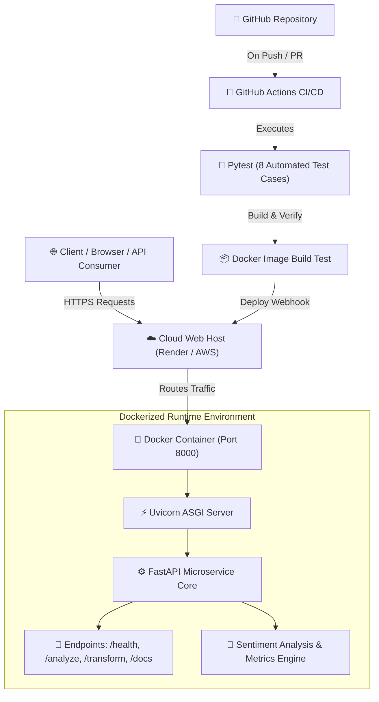

# 🚀 Cloud-Native Text Analytics Microservice

[](https://github.com/tanned366/cloud-microservice/actions)
[](https://opensource.org/licenses/MIT)
[](https://www.python.org/)
[](https://fastapi.tiangolo.com)
[](https://www.docker.com/)

A production-ready, containerized microservice for real-time text sentiment classification, statistical analysis, and string transformations. Built with **FastAPI**, containerized using **Docker**, automated with **GitHub Actions CI/CD**, and deployed on a **Free Cloud Web Service**.

---

## 📐 Architecture Overview



### Flow Breakdown:
1. **Client Request**: Clients interact via RESTful JSON APIs or Swagger UI at `/docs`.
2. **Cloud Host**: Ingress HTTPS traffic is routed to our containerized service.
3. **Container**: Lightweight `python:3.11-slim` container hosting the FastAPI app.
4. **CI/CD Pipeline**: GitHub Actions validates every commit by running 8 automated unit tests. Pushes with failing tests are automatically flagged and blocked.

---

## ✨ Features & Endpoints

| Method | Endpoint | Description |
| :--- | :--- | :--- |
| `GET` | `/` | Root status, metadata, and quick link to documentation. |
| `GET` | `/health` | Live operational health check, uptime, and request telemetry. |
| `POST` | `/analyze` | Computes sentiment (positive/negative/neutral), sentiment score, word count, character count, sentence count, and reading time. |
| `POST` | `/transform` | Performs text mutations (`uppercase`, `lowercase`, `reverse`, `titlecase`). |
| `GET` | `/docs` | Interactive Swagger API playground. |
| `GET` | `/redoc` | ReDoc API technical documentation. |

---

## 🧪 Automated Testing & CI/CD

This project includes **8 automated unit tests** using `pytest` and `fastapi.testclient`:

* `test_1_root_endpoint`: Validates root endpoint status and version payload.
* `test_2_health_check_endpoint`: Verifies system uptime counter and health state.
* `test_3_analyze_positive_sentiment`: Validates sentiment classification and score computation on positive inputs.
* `test_4_analyze_negative_sentiment`: Validates negative sentiment classification.
* `test_5_analyze_empty_payload_validation`: Ensures 422 Unprocessable Entity error is returned for blank payloads.
* `test_6_transform_uppercase`: Tests uppercase string manipulation logic.
* `test_7_transform_reverse`: Tests string reversal logic.
* `test_8_transform_invalid_operation`: Confirms 400 Bad Request handling for unsupported operations.

### CI/CD Workflow (`.github/workflows/ci.yml`)
1. **Checkout code**: Pulls code onto Ubuntu runner.
2. **Python Setup**: Configures Python 3.11 and pip caching.
3. **Dependency Installation**: Installs requirements from `requirements.txt`.
4. **Test Execution**: Executes `pytest -v tests/`.
5. **Docker Build Test**: Verifies `Dockerfile` builds cleanly.

---

## 🚀 Running Locally

### Option A: Using Python directly
```bash
# 1. Create and activate a virtual environment
python -m venv .venv
source .venv/bin/activate  # On Windows: .venv\Scripts\activate

# 2. Install dependencies
pip install -r requirements.txt

# 3. Run the automated tests
pytest -v

# 4. Start the development server
uvicorn app.main:app --reload --port 8000
```
Open [http://127.0.0.1:8000/docs](http://127.0.0.1:8000/docs) in your browser.

---

### Option B: Using Docker
```bash
# Build the Docker image
docker build -t cloud-microservice .

# Run the container
docker run -p 8000:8000 cloud-microservice
```
Open [http://localhost:8000/docs](http://localhost:8000/docs) in your browser.

---

### Option C: Using Docker Compose
```bash
docker compose up --build
```

---

## ☁️ Cloud Deployment (Render / AWS)

1. Connect this GitHub repository to [Render](https://render.com).
2. Create a new **Web Service** selecting **Docker** runtime.
3. Select the **Free** instance type ($0/month).
4. Render automatically builds the container from `Dockerfile` and publishes the live HTTPS service.

---

## 📋 Sample API Usage

### Analyze Text
```bash
curl -X POST "http://localhost:8000/analyze" \
     -H "Content-Type: application/json" \
     -d '{"text": "Cloud computing and microservices are awesome and reliable!"}'
```

**Response:**
```json
{
  "text": "Cloud computing and microservices are awesome and reliable!",
  "character_count": 59,
  "word_count": 8,
  "sentence_count": 1,
  "sentiment": "positive",
  "sentiment_score": 1.0,
  "reading_time_seconds": 2.4
}
```

---

## 👨‍💻 Author & Assessment Details
* **Project**: Distributed Systems & Cloud Technology Graded Assessment
* **Repository**: [github.com/tanned366/cloud-microservice](https://github.com/tanned366/cloud-microservice)
