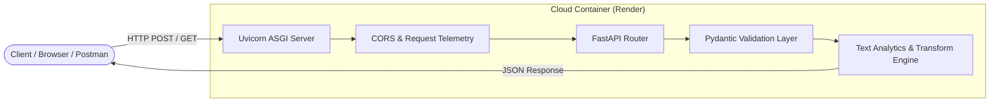

# 🚀 Cloud-Native Text Analytics Microservice

[](https://github.com/tanned366/cloud-microservice/actions)
[](https://opensource.org/licenses/MIT)
[](https://www.python.org/)
[](https://fastapi.tiangolo.com)
[](https://www.docker.com/)

> 🌐 **Live Cloud API:** [https://cloud-microservice.onrender.com](https://cloud-microservice.onrender.com)  
> 📖 **Interactive Swagger UI:** [https://cloud-microservice.onrender.com/docs](https://cloud-microservice.onrender.com/docs)  
> 🩺 **Health Check & Telemetry:** [https://cloud-microservice.onrender.com/health](https://cloud-microservice.onrender.com/health)

A cloud-native microservice built for real-time text analysis, sentiment scoring, and string transformations. Packaged in Docker containers, verified with GitHub Actions CI/CD, and deployed live on cloud infrastructure.

---

## 🏛️ System Architecture


```mermaid
flowchart LR
    Client([Client / Browser / Postman])
    
    subgraph Cloud ["Cloud Container (Render)"]
        Uvicorn["Uvicorn ASGI Server"]
        Middleware["CORS & Request Telemetry"]
        Router["FastAPI Router"]
        Validation["Pydantic Validation Layer"]
        Engine["Text Analytics & Transform Engine"]
    end

    Client -->|HTTP POST / GET| Uvicorn
    Uvicorn --> Middleware
    Middleware --> Router
    Router --> Validation
    Validation --> Engine
    Engine -->|JSON Response| Client
```

### Architecture Breakdown:
1. **Client Layer**: Sends RESTful requests via HTTP clients (curl, browser, or Swagger UI).
2. **Ingress & ASGI**: Traffic is routed to the `python:3.11-slim` container where Uvicorn handles async connections.
3. **Middleware & Routing**: Tracks live request counts and routes endpoints (`/`, `/health`, `/analyze`, `/transform`).
4. **Validation Layer**: Pydantic schemas enforce type constraints and input sanitization before execution.
5. **Analytics Engine**: Computes word/char statistics, sentiment classification, and string mutations in-memory.

---

## 📁 Repository Structure

```
cloud-microservice/
├── app/
│   ├── __init__.py        # Package initialization & version metadata
│   ├── main.py            # FastAPI endpoints, middleware & routing
│   ├── models.py          # Pydantic data schemas & input validation
│   └── utils.py           # Core sentiment algorithms & transformations
├── tests/
│   ├── __init__.py        # Test suite package definition
│   └── test_main.py       # 8 automated unit & integration tests
├── .github/workflows/
│   └── ci.yml             # GitHub Actions CI/CD test & build pipeline
├── docker-compose.yml     # Multi-container orchestration specification
├── Dockerfile             # Multi-stage optimized container recipe
├── requirements.txt       # Pinned application dependencies
└── README.md              # Project documentation and architecture guide
```

---

## ✨ Endpoints & Capabilities

| Method | Endpoint | Description |
| :--- | :--- | :--- |
| `GET` | `/` | Root status, version metadata, and documentation link |
| `GET` | `/health` | Live operational status, server uptime, and total processed requests |
| `POST` | `/analyze` | Sentiment classification (`positive`/`negative`/`neutral`), score, word count, character count, sentence count, and reading time |
| `POST` | `/transform` | Case transformations (`uppercase`, `lowercase`, `titlecase`) and string reversal (`reverse`) |
| `GET` | `/docs` | Interactive Swagger UI API playground |
| `GET` | `/redoc` | ReDoc API technical reference |

---

## 🛠️ Local Development

### With Docker (Recommended)
```bash
docker compose up --build
```
The API will be available at [http://localhost:8000/docs](http://localhost:8000/docs).

### With Python Virtual Environment
```bash
# 1. Create and activate virtual environment
python -m venv .venv
# Linux/macOS: source .venv/bin/activate
# Windows: .venv\Scripts\activate

# 2. Install dependencies
pip install -r requirements.txt

# 3. Run automated tests
pytest -v

# 4. Start the development server
uvicorn app.main:app --reload --port 8000
```
Open [http://127.0.0.1:8000/docs](http://127.0.0.1:8000/docs) in your browser.

---

## 🧪 Automated Testing & CI/CD Pipeline

The project includes **8 automated unit tests** using `pytest` and `fastapi.testclient`:

```bash
pytest -v
```

### Verified Test Cases:
1. `test_1_root_endpoint`: Validates root endpoint status (200 OK) and version payload.
2. `test_2_health_check_endpoint`: Verifies system uptime counter and telemetry state.
3. `test_3_analyze_positive_sentiment`: Validates sentiment classification and score on positive inputs.
4. `test_4_analyze_negative_sentiment`: Validates negative sentiment classification.
5. `test_5_analyze_empty_payload_validation`: Ensures `422 Unprocessable Entity` is returned for blank payloads.
6. `test_6_transform_uppercase`: Tests uppercase string manipulation logic.
7. `test_7_transform_reverse`: Tests string reversal logic.
8. `test_8_transform_invalid_operation`: Confirms `400 Bad Request` handling for unsupported operations.

### CI/CD Workflow (`.github/workflows/ci.yml`)
* **Trigger**: Every push or pull request to the `main` branch.
* **Steps**: Environment setup $\rightarrow$ dependency caching $\rightarrow$ running test suite $\rightarrow$ Docker container build test.
* **Protection**: Failing tests automatically block deployments.

---

## 📋 Sample API Usage

### 1. Analyze Text
```bash
curl -X POST "https://cloud-microservice.onrender.com/analyze" \
     -H "Content-Type: application/json" \
     -d '{"text": "Cloud computing and microservices are awesome and reliable!"}'
```

**Response:**
```json
{
  "text": "Cloud computing and microservices are awesome and reliable!",
  "character_count": 59,
  "word_count": 8,
  "sentence_count": 1,
  "sentiment": "positive",
  "sentiment_score": 1.0,
  "reading_time_seconds": 2.4
}
```

### 2. Transform Text
```bash
curl -X POST "https://cloud-microservice.onrender.com/transform" \
     -H "Content-Type: application/json" \
     -d '{
       "text": "cloud native microservice",
       "operation": "uppercase"
     }'
```

**Response:**
```json
{
  "original_text": "cloud native microservice",
  "operation": "uppercase",
  "result": "CLOUD NATIVE MICROSERVICE",
  "length": 25
}
```

### 3. Check Live Health & Metrics
```bash
curl -X GET "https://cloud-microservice.onrender.com/health"
```

**Response:**
```json
{
  "status": "healthy",
  "version": "1.0.0",
  "uptime_seconds": 342.18,
  "total_requests_processed": 28,
  "environment": "production"
}
```

---

## 👨‍💻 Author & Assessment Details
* **Course**: Distributed Systems & Cloud Technology Graded Assessment
* **Repository**: [github.com/tanned366/cloud-microservice](https://github.com/tanned366/cloud-microservice)
* **Live Deployment**: [cloud-microservice.onrender.com](https://cloud-microservice.onrender.com)
